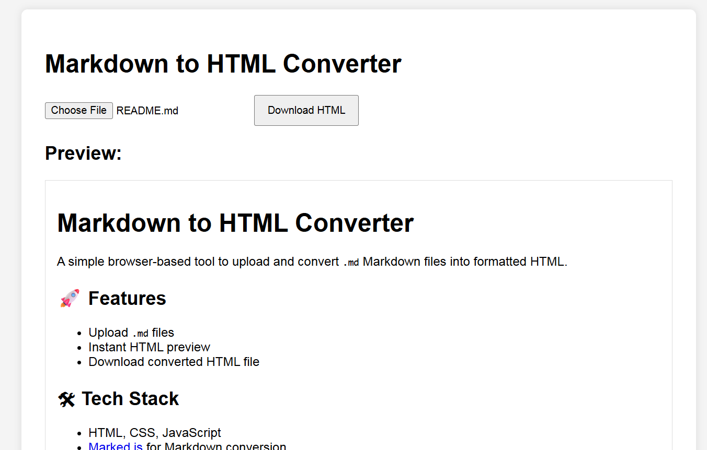

# Markdown to HTML Converter

A simple browser-based tool to upload and convert `.md` Markdown files into formatted HTML.

## 🚀 Features

- Upload `.md` files
- Instant HTML preview
- Download converted HTML file

## 🛠 Tech Stack

- HTML, CSS, JavaScript
- [Marked.js](https://marked.js.org/) for Markdown conversion

## 📂 Usage

1. Open `index.html` in your browser
2. Upload a Markdown file
3. View rendered HTML
4. Click "Download HTML" to save

## 📸 Screenshot
 
 
---

## 🤝 Contributing
Pull requests are welcome! If you'd like to improve the tool or add features, feel free to fork the repo and open a PR.

## Auther
- Bishow Ghimire
